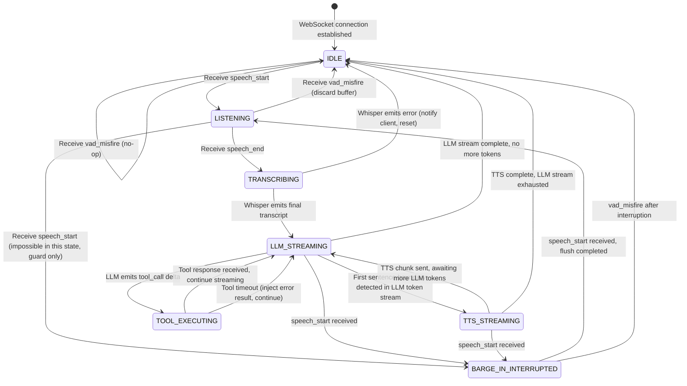

# Product Requirements Document (PRD): Ultra-Low Latency Voice AI Agent
### Version 2.0 — Architect-Grade Specification
**Date:** 2026-08-23 | **Status:** APPROVED FOR IMPLEMENTATION

---

## Table of Contents

1. [System Objectives & Constraints](#1-system-objectives--constraints)
2. [Audio Pipeline Specification](#2-audio-pipeline-specification)
3. [WebSocket Protocol & State Machine](#3-websocket-protocol--state-machine)
4. [Tool Calling Contracts](#4-tool-calling-contracts)
5. [Advanced Features](#5-advanced-features)
6. [Implementation Checklist for Autonomous Agent](#6-implementation-checklist-for-autonomous-agent)

---

## 1. System Objectives & Constraints

### 1.1 End-to-End Latency Budget

The primary SLA is **< 800ms from the last spoken frame to the first audio byte played back** on the client. This budget excludes the duration of the user speaking.

| Stage | Component | Target Budget | Notes |
|---|---|---|---|
| **VAD Silence Detection** | Silero WASM (client) | ≤ 30ms | Time from last voiced frame to `speech_end` event |
| **Audio Flush + WS Send** | Browser → Node.js | ≤ 20ms | Remaining buffer flush + WebSocket transmission |
| **STT Transcription** | Faster-Whisper (local) | ≤ 180ms | For utterances ≤ 10s; `tiny.en` or `base.en` model |
| **LLM First Token** | Groq API (Llama 3.1-8B) | ≤ 250ms | Time-to-first-token (TTFT) via Groq LPU |
| **LLM → TTS Sentence Buffer** | Node.js sentence splitter | ≤ 30ms | Accumulate first sentence boundary |
| **TTS First Audio Chunk** | Piper (local subprocess) | ≤ 200ms | `stdin` pipe → first PCM chunk out |
| **Audio Transmission** | Node.js → Client WS | ≤ 20ms | First audio packet to client |
| **Client Audio Queue** | Web Audio API | ≤ 20ms | `AudioContext` scheduling overhead |
| **Contingency** | Buffer | ≤ 70ms | Network jitter, GC pauses, process scheduling |
| **TOTAL** | | **< 800ms** | |

> **CRITICAL:** Tool calls break the standard path. When a tool call is detected, the entire tool execution budget must stay within **500ms** to maintain the total < 800ms SLA. If a tool exceeds this, the system MUST stream a filler phrase via TTS immediately (see §4.3).

### 1.2 Hardware Constraints

| Resource | Limit | Implication |
|---|---|---|
| RAM | 16 GB total | Node.js: ≤ 512MB; Faster-Whisper (`base.en`): ≤ 1.5GB (model + decode buffers); Piper: ≤ 256MB; OS overhead: ~4GB; Slack: ~10GB |
| CPU | No GPU | Faster-Whisper must run `device="cpu"`, `compute_type="int8"`. Piper runs native ARM/x86 binary. |
| LLM | Zero local GPU | **All LLM inference is offloaded to Groq LPU**. No local Ollama or similar. |
| Disk I/O | SSD preferred | Whisper model load on startup; do NOT reload per request. |
| Concurrency | 1 active session | Designed for single-user sessions; no multi-tenancy on local hardware. |

### 1.3 Non-Functional Requirements

- **Privacy:** Audio never persists to disk. All buffers are in-memory only.
- **Fault Isolation:** STT subprocess crash must NOT crash Node.js process. Use `child_process` with restart logic.
- **Graceful Degradation:** If Groq API returns `503` or times out at 2s, emit a TTS filler phrase and retry once.

---

## 2. Audio Pipeline Specification

### 2.1 Client Microphone Capture

The browser client MUST capture and stream audio in the following exact format:

| Parameter | Value | Rationale |
|---|---|---|
| **Format** | Linear 16-bit PCM (L16) | Faster-Whisper native input; no codec overhead |
| **Sample Rate** | 16,000 Hz (16kHz) | Whisper model training spec; downsampling from 48kHz handled client-side |
| **Channels** | 1 (Mono) | Reduces byte stream by 50%; voice does not need stereo |
| **Bit Depth** | 16-bit signed integer | PCM L16 standard |
| **Chunk Size** | 512 samples (32ms frames) | Aligned with Silero VAD's required 512-sample frame size at 16kHz |
| **Container** | Raw PCM bytes (no WAV header) | Header is sent once at session start via `session_init` WS event |
| **Transmission** | Binary WebSocket frames | `binaryType = "arraybuffer"` on client |

**Web Audio API Implementation Notes:**
```
AudioContext.sampleRate → MUST be 16000 (or resample via OfflineAudioContext)
ScriptProcessorNode / AudioWorkletNode buffer size → 512 samples
getChannelData(0) → Int16Array → send via ws.send(buffer)
```

If the browser's native sample rate is 48kHz (common on macOS/Linux), you MUST use `OfflineAudioContext` to resample to 16kHz before streaming. A `ResampleWorklet` is required.

### 2.2 Voice Activity Detection (VAD)

**Library:** `@ricky0123/vad-web` (Silero VAD compiled to WASM) — runs entirely in the browser.

| VAD Parameter | Value | Description |
|---|---|---|
| `frameSamples` | `512` | Must be exactly 512 at 16kHz; this is 32ms per frame |
| `positiveSpeechThreshold` | `0.50` | Probability above which a frame is labeled "speech" |
| `negativeSpeechThreshold` | `0.35` | Probability below which a frame is labeled "silence" |
| `minSpeechFrames` | `3` | Minimum consecutive speech frames to trigger LISTENING (96ms of speech required) |
| `preSpeechPadFrames` | `5` | Pre-buffer 5 frames (160ms) before VAD triggers to avoid clipping utterance start |
| `redemptionFrames` | `8` | Frames to wait after silence threshold before declaring end-of-speech (256ms silence window) |

**VAD Events → WebSocket Actions:**

| VAD Event | Action |
|---|---|
| `onSpeechStart` | Send `{ type: "speech_start" }` JSON frame; begin streaming binary PCM chunks |
| `onFrameProcessed` | If speech active: send raw PCM `ArrayBuffer` as binary WS frame |
| `onSpeechEnd` | Send `{ type: "speech_end", duration_ms: N }` JSON frame; stop sending PCM |
| `onVADMisfire` | Send `{ type: "vad_misfire" }`; server discards buffered audio, returns to IDLE |

### 2.3 Faster-Whisper Subprocess (Server-Side)

Faster-Whisper runs as a **persistent Python subprocess** managed by Node.js. It must NOT be spawned per-request (startup cost is ~800ms).

**Subprocess Architecture:**
```
Node.js ──stdin──► [faster_whisper_server.py] ──stdout──► Node.js
         (raw PCM)                              (JSON lines)
```

**Python subprocess (`faster_whisper_server.py`) specification:**

```python
# STDIN protocol: Reads length-prefixed PCM frames
# Frame format: [4-byte uint32 LE = byte_count][PCM bytes]
# Signals end-of-utterance: [4-byte uint32 LE = 0x00000000] (zero-length frame)

# STDOUT protocol: Newline-delimited JSON
# { "type": "partial", "text": "...", "ts": 1234567890.123 }
# { "type": "final",   "text": "...", "duration_ms": 145, "ts": 1234567890.456 }
# { "type": "error",   "code": "DECODE_FAIL", "msg": "..." }

# Whisper model configuration:
model = WhisperModel(
    model_size_or_path="base.en",   # Use "tiny.en" if RAM < 14GB
    device="cpu",
    compute_type="int8",            # MANDATORY for CPU; halves RAM and speeds inference
    num_workers=2,
    download_root="/tmp/whisper_models"
)

# Transcription call (called per utterance after zero-length EOF frame):
segments, info = model.transcribe(
    audio_buffer,                   # numpy float32 array, 16kHz
    language="en",
    beam_size=1,                    # Greedy decoding; fastest
    vad_filter=False,               # VAD already done client-side
    word_timestamps=False,
    condition_on_previous_text=True
)
```

**Node.js subprocess management:**
```javascript
// spawn once at server startup
const whisperProc = spawn('python3', ['faster_whisper_server.py'], {
  stdio: ['pipe', 'pipe', 'pipe']
});
whisperProc.stdout.setEncoding('utf8');
// Pipe incoming WS binary frames → whisperProc.stdin
// Parse whisperProc.stdout line-by-line for JSON events
// On crash: restart after 500ms, re-enter IDLE state, notify client
```

### 2.4 Piper TTS Subprocess (Server-Side)

Piper runs as a **persistent subprocess**, pre-loaded with a voice model.

**Subprocess Architecture:**
```
Node.js ──stdin──► [piper binary] ──stdout──► Node.js ──WS──► Client
         (text)                    (raw PCM)
```

**Piper invocation:**
```bash
piper \
  --model /models/en_US-lessac-medium.onnx \
  --config /models/en_US-lessac-medium.onnx.json \
  --output-raw \
  --sentence-silence 0.1 \
  --json-input
```

**Piper stdin protocol (JSON per line):**
```json
{ "text": "The sentence to synthesize here." }
```

**Piper stdout:** Raw 16-bit PCM at **22,050 Hz, mono** (Piper default). Node.js re-chunks into 4KB frames for WebSocket streaming.

> **NOTE:** The client's `AudioContext` must be initialized at **22050 Hz** to match Piper output, or Node.js must resample. Do NOT mix with the 16kHz capture context — use two separate `AudioContext` instances.

**Barge-in flush procedure:**
```javascript
// On receiving speech_start while in TTS_STREAMING state:
piperProc.stdin.write('\n'); // Send empty line to flush sentence
piperProc.stdin.cork();      // Prevent further writes
// Kill and restart Piper subprocess within 50ms
// Drain and discard any buffered stdout chunks
// Send { type: "tts_interrupted" } to client
// Client: AudioContext.suspend() → clear queue → AudioContext.resume()
```

---

## 3. WebSocket Protocol & State Machine

### 3.1 Server State Machine



### 3.2 State Transition Table

| Current State | Event Received | Next State | Side Effects |
|---|---|---|---|
| `IDLE` | `speech_start` | `LISTENING` | Open Whisper stdin pipe; start audio buffer |
| `IDLE` | `vad_misfire` | `IDLE` | No-op |
| `LISTENING` | Binary PCM frame | `LISTENING` | Forward to Whisper stdin |
| `LISTENING` | `speech_end` | `TRANSCRIBING` | Send EOF frame (0x00000000) to Whisper |
| `LISTENING` | `vad_misfire` | `IDLE` | Send discard frame to Whisper; clear buffer |
| `TRANSCRIBING` | Whisper `partial` | `TRANSCRIBING` | Emit `transcript_partial` to client; pre-fetch logic |
| `TRANSCRIBING` | Whisper `final` | `LLM_STREAMING` | Send full prompt to Groq; update conversation history |
| `TRANSCRIBING` | Whisper `error` | `IDLE` | Send `error` event to client |
| `LLM_STREAMING` | Token delta (text) | `LLM_STREAMING` | Buffer tokens; check sentence boundary; pipe to Piper |
| `LLM_STREAMING` | Token delta (tool_call) | `TOOL_EXECUTING` | Pause TTS; execute tool |
| `LLM_STREAMING` | Stream complete | `IDLE` | Flush remaining TTS; send `turn_complete` |
| `LLM_STREAMING` | `speech_start` | `BARGE_IN_INTERRUPTED` | Abort Groq stream; kill Piper; send `barge_in` to client |
| `TTS_STREAMING` | `speech_start` | `BARGE_IN_INTERRUPTED` | Kill Piper stdin; drain stdout; restart Piper |
| `TOOL_EXECUTING` | Tool result | `LLM_STREAMING` | Inject tool result into Groq continuation call |
| `TOOL_EXECUTING` | 500ms timeout | `LLM_STREAMING` | Inject synthetic error result; continue |
| `BARGE_IN_INTERRUPTED` | `speech_start` (new) | `LISTENING` | Re-open Whisper; begin new utterance |

### 3.3 WebSocket Message Schemas

All messages are UTF-8 JSON unless noted as `[BINARY]`.

#### 3.3.1 Client → Server Messages

---

**`speech_start`**
```json
{
  "type": "speech_start",
  "session_id": "string (UUID v4)",
  "timestamp_ms": "number (epoch ms)"
}
```

---

**`[BINARY] PCM Audio Frame`**

Raw binary `ArrayBuffer` — no JSON wrapper. Node.js detects binary frames by `ws.on('message', (data, isBinary)`.

```
[ArrayBuffer: Int16 PCM samples, 512 samples = 1024 bytes per frame]
```

---

**`speech_end`**
```json
{
  "type": "speech_end",
  "session_id": "string",
  "duration_ms": "number",
  "timestamp_ms": "number"
}
```

---

**`vad_misfire`**
```json
{
  "type": "vad_misfire",
  "session_id": "string",
  "timestamp_ms": "number"
}
```

---

**`session_init`** _(Sent once on connection)_
```json
{
  "type": "session_init",
  "session_id": "string (UUID v4)",
  "audio_format": {
    "sample_rate": 16000,
    "channels": 1,
    "bit_depth": 16,
    "encoding": "pcm_s16le"
  },
  "client_capabilities": {
    "supports_barge_in": true,
    "vad_library": "silero-v5",
    "browser": "string"
  }
}
```

---

**`tool_result`** _(Client-side tool execution only — typically server-side)_
```json
{
  "type": "tool_result",
  "tool_call_id": "string",
  "result": "object | string",
  "error": "string | null"
}
```

---

#### 3.3.2 Server → Client Messages

---

**`session_ack`**
```json
{
  "type": "session_ack",
  "session_id": "string",
  "server_version": "string (semver)",
  "tts_sample_rate": 22050,
  "state": "IDLE"
}
```

---

**`state_change`**
```json
{
  "type": "state_change",
  "from": "IDLE | LISTENING | TRANSCRIBING | LLM_STREAMING | TTS_STREAMING | BARGE_IN_INTERRUPTED | TOOL_EXECUTING",
  "to": "IDLE | LISTENING | TRANSCRIBING | LLM_STREAMING | TTS_STREAMING | BARGE_IN_INTERRUPTED | TOOL_EXECUTING",
  "timestamp_ms": "number"
}
```

---

**`transcript_partial`**
```json
{
  "type": "transcript_partial",
  "session_id": "string",
  "text": "string",
  "confidence": "number (0.0–1.0) | null",
  "timestamp_ms": "number"
}
```

---

**`transcript_final`**
```json
{
  "type": "transcript_final",
  "session_id": "string",
  "text": "string",
  "duration_ms": "number",
  "timestamp_ms": "number"
}
```

---

**`llm_token`**
```json
{
  "type": "llm_token",
  "session_id": "string",
  "delta": "string",
  "token_index": "number",
  "timestamp_ms": "number"
}
```

---

**`tool_call`**
```json
{
  "type": "tool_call",
  "session_id": "string",
  "tool_call_id": "string (matches Groq response)",
  "tool_name": "order_food | book_flight | string",
  "arguments": "object (parsed JSON)",
  "timestamp_ms": "number"
}
```

---

**`[BINARY] TTS Audio Chunk`**

Raw `ArrayBuffer` containing Int16 PCM at 22050 Hz. No JSON wrapper.

**Framing header prefix (4 bytes):** `[0xAF][0xFE][uint16_LE chunk_sequence]` followed by raw PCM bytes.

---

**`tts_interrupted`**
```json
{
  "type": "tts_interrupted",
  "session_id": "string",
  "reason": "barge_in",
  "timestamp_ms": "number"
}
```
*Client action: call `audioContext.suspend()`, clear all queued `AudioBufferSourceNode`s, call `audioContext.resume()`.*

---

**`turn_complete`**
```json
{
  "type": "turn_complete",
  "session_id": "string",
  "total_latency_ms": "number",
  "token_count": "number",
  "timestamp_ms": "number"
}
```

---

**`error`**
```json
{
  "type": "error",
  "session_id": "string",
  "code": "STT_FAIL | LLM_TIMEOUT | TTS_FAIL | TOOL_TIMEOUT | INVALID_STATE | INTERNAL",
  "message": "string",
  "recoverable": "boolean",
  "timestamp_ms": "number"
}
```

---

## 4. Tool Calling Contracts

### 4.1 Groq API Configuration for Tool Calling

```javascript
const groqClient = new Groq({ apiKey: process.env.GROQ_API_KEY });

const response = await groqClient.chat.completions.create({
  model: "llama-3.1-8b-instant",    // Fastest Groq model with tool support
  messages: conversationHistory,
  tools: [TOOL_ORDER_FOOD, TOOL_BOOK_FLIGHT, TOOL_GET_WEATHER, TOOL_GET_NEWS, TOOL_SEARCH_BROWSER],
  tool_choice: "auto",
  stream: true,                     // MANDATORY: streaming must remain enabled
  max_tokens: 512,
  temperature: 0.3,                 // Low temperature for deterministic tool arg generation
});
```

### 4.2 Tool Definition: `order_food`

```json
{
  "type": "function",
  "function": {
    "name": "order_food",
    "description": "Place a food delivery order from a restaurant. Use this when the user wants to order food, meals, snacks, or beverages for delivery or pickup.",
    "parameters": {
      "type": "object",
      "properties": {
        "restaurant_name": {
          "type": "string",
          "description": "The name of the restaurant to order from. Must be a string of 2–100 characters.",
          "minLength": 2,
          "maxLength": 100
        },
        "items": {
          "type": "array",
          "description": "List of food items to order. Must contain at least one item.",
          "minItems": 1,
          "maxItems": 20,
          "items": {
            "type": "object",
            "properties": {
              "name": {
                "type": "string",
                "description": "Name of the food item.",
                "minLength": 1,
                "maxLength": 100
              },
              "quantity": {
                "type": "integer",
                "description": "Number of this item to order.",
                "minimum": 1,
                "maximum": 50
              },
              "special_instructions": {
                "type": "string",
                "description": "Any special preparation instructions (e.g., 'no onions', 'extra spicy').",
                "maxLength": 200
              }
            },
            "required": ["name", "quantity"]
          }
        },
        "delivery_address": {
          "type": "string",
          "description": "Full delivery address including street, city, and postal code.",
          "minLength": 10,
          "maxLength": 300
        },
        "delivery_type": {
          "type": "string",
          "enum": ["delivery", "pickup"],
          "description": "Whether the order is for delivery or pickup."
        },
        "scheduled_time": {
          "type": "string",
          "description": "ISO 8601 datetime for scheduled delivery/pickup. If null, order is ASAP.",
          "pattern": "^\\d{4}-\\d{2}-\\d{2}T\\d{2}:\\d{2}:\\d{2}Z$"
        },
        "payment_method": {
          "type": "string",
          "enum": ["saved_card", "cash", "digital_wallet"],
          "description": "Payment method to use for this order."
        }
      },
      "required": ["restaurant_name", "items", "delivery_type"],
      "additionalProperties": false
    }
  }
}
```

**Validation Rules (server-side, applied before API call):**
- `items.length >= 1` → else throw `VALIDATION_ERROR: "Order must have at least one item"`
- `delivery_type === "delivery"` requires `delivery_address` to be present → else streaming TTS ask: *"Where should I deliver your order?"*
- `scheduled_time` if provided must be parseable as ISO 8601 and must be in the future → else treat as ASAP

> **TESTING NOTE:** Do NOT use a real restaurant API that charges money or places real orders. Connect this tool to a mock/sandbox endpoint for integration testing.

### 4.3 Tool Definition: `book_flight`

```json
{
  "type": "function",
  "function": {
    "name": "book_flight",
    "description": "Search for and book a flight. Use when the user wants to fly somewhere, book plane tickets, or find flights between cities.",
    "parameters": {
      "type": "object",
      "properties": {
        "origin": {
          "type": "string",
          "description": "Departure airport IATA code (e.g., 'JFK', 'LHR', 'BOM').",
          "pattern": "^[A-Z]{3}$"
        },
        "destination": {
          "type": "string",
          "description": "Arrival airport IATA code (e.g., 'LAX', 'CDG', 'DEL').",
          "pattern": "^[A-Z]{3}$"
        },
        "departure_date": {
          "type": "string",
          "description": "Departure date in YYYY-MM-DD format.",
          "pattern": "^\\d{4}-\\d{2}-\\d{2}$"
        },
        "return_date": {
          "type": "string",
          "description": "Return date for round trips in YYYY-MM-DD format. Omit for one-way.",
          "pattern": "^\\d{4}-\\d{2}-\\d{2}$"
        },
        "trip_type": {
          "type": "string",
          "enum": ["one_way", "round_trip"],
          "description": "Whether this is a one-way or round-trip flight."
        },
        "passengers": {
          "type": "object",
          "description": "Number of passengers by type.",
          "properties": {
            "adults": {
              "type": "integer",
              "minimum": 1,
              "maximum": 9
            },
            "children": {
              "type": "integer",
              "minimum": 0,
              "maximum": 9
            },
            "infants": {
              "type": "integer",
              "minimum": 0,
              "maximum": 9
            }
          },
          "required": ["adults"]
        },
        "cabin_class": {
          "type": "string",
          "enum": ["economy", "premium_economy", "business", "first"],
          "description": "Preferred cabin class.",
          "default": "economy"
        },
        "preferred_airlines": {
          "type": "array",
          "items": {
            "type": "string",
            "description": "2-letter IATA airline code (e.g., 'AA', 'UA', 'DL').",
            "pattern": "^[A-Z]{2}$"
          },
          "maxItems": 5,
          "description": "Optional list of preferred airline codes."
        },
        "max_price_usd": {
          "type": "number",
          "description": "Maximum acceptable price per person in USD.",
          "minimum": 0,
          "maximum": 50000
        },
        "non_stop_only": {
          "type": "boolean",
          "description": "If true, only return non-stop flights.",
          "default": false
        }
      },
      "required": ["origin", "destination", "departure_date", "trip_type", "passengers"],
      "additionalProperties": false
    }
  }
}
```

**Validation Rules (server-side):**
- `origin !== destination` → else streaming TTS clarification: *"It looks like your origin and destination are the same. Where are you flying to?"*
- `departure_date` must be ≥ today's date → else TTS: *"The departure date seems to be in the past."*
- `trip_type === "round_trip"` requires `return_date` → else streaming TTS ask: *"What date would you like to return?"*
- `return_date` must be ≥ `departure_date` if present → else TTS error

> **TESTING NOTE:** Do NOT use a real airline booking API. Connect this tool to a mock, sandbox, or free test endpoint for integration testing to prevent accidental charges.

### 4.4 Tool Definition: `get_weather`

```json
{
  "type": "function",
  "function": {
    "name": "get_weather",
    "description": "Get the current weather conditions for a specific location. Use this when the user asks about the weather, temperature, or forecast.",
    "parameters": {
      "type": "object",
      "properties": {
        "location": {
          "type": "string",
          "description": "The city, state, or zip code to get the weather for (e.g., 'San Francisco, CA', 'London', '10001')."
        },
        "units": {
          "type": "string",
          "enum": ["celsius", "fahrenheit"],
          "description": "Temperature units. Default to the most common unit for the location if not specified by the user.",
          "default": "celsius"
        }
      },
      "required": ["location"],
      "additionalProperties": false
    }
  }
}
```

> **TESTING NOTE:** Use a free API like OpenWeatherMap (free tier) for testing this tool.

### 4.5 Tool Definition: `get_news`

```json
{
  "type": "function",
  "function": {
    "name": "get_news",
    "description": "Get the latest news headlines. Use this when the user asks for the news, current events, or top stories.",
    "parameters": {
      "type": "object",
      "properties": {
        "topic": {
          "type": "string",
          "description": "Specific topic or category to search for (e.g., 'technology', 'business', 'sports', 'politics'). Optional."
        },
        "country": {
          "type": "string",
          "description": "2-letter ISO 3166-1 alpha-2 country code (e.g., 'us', 'gb', 'in'). Optional.",
          "pattern": "^[a-zA-Z]{2}$"
        }
      },
      "additionalProperties": false
    }
  }
}
```

> **TESTING NOTE:** Use a free API like NewsAPI (developer tier) or GNews API for testing this tool.

### 4.6 Tool Definition: `search_browser`

```json
{
  "type": "function",
  "function": {
    "name": "search_browser",
    "description": "Perform a web search using a browser to find information. Use this when the user asks a general question, wants to look up facts, or needs information from the internet.",
    "parameters": {
      "type": "object",
      "properties": {
        "query": {
          "type": "string",
          "description": "The search query to look up (e.g., 'who won the 2026 super bowl', 'how to bake a cake', 'tallest mountain in the world')."
        }
      },
      "required": ["query"],
      "additionalProperties": false
    }
  }
}
```

> **TESTING NOTE:** Use a free search API like Google Custom Search API (free tier), DuckDuckGo, or SerpApi for testing this tool.

### 4.7 Tool Execution Flow & Error Handling

```
LLM emits tool_call delta
    │
    ▼
[Parse & validate tool arguments] ──── FAIL ──► Stream TTS clarification, re-enter LLM_STREAMING
    │
    ▼ PASS
[Execute tool API call] ─────────────────────────────────────────────────────────────────────┐
    │                                                                                         │
    │ Success (< 500ms)                                                    Timeout (>= 500ms) │
    ▼                                                                                         │
[Inject tool result into Groq                                  [Stream TTS filler phrase]:   │
 continuation call as                                          "Let me check on that for     │
 tool message role]                                             you one moment..."           │
    │                                                           [Retry tool call once]       │
    ▼                                                           [If still fails: inject       │
[Continue LLM_STREAMING]                                        synthetic error result]      │
                                                                      │                     │
                                                                      └─────────────────────┘
                                                                      [Continue LLM_STREAMING with
                                                                       error result in context]
```

**Synthetic Error Result Schema (injected when tool fails):**
```json
{
  "tool_call_id": "call_abc123",
  "role": "tool",
  "content": "{\"error\": true, \"code\": \"TOOL_TIMEOUT\", \"message\": \"The service is temporarily unavailable. Please try again in a moment.\", \"retry_after_ms\": 2000}"
}
```

**Filler TTS Phrases (cycle through to avoid repetition):**
```javascript
const TOOL_FILLER_PHRASES = [
  "One moment while I look that up.",
  "Let me check on that for you.",
  "Give me just a second.",
  "I'm looking into that now."
];
```

---

## 5. Advanced Features

### 5.1 Predictive Tool Pre-fetching (MCP Integration)

**Objective:** Reduce perceived tool latency by beginning tool preparation during transcription, before the user's full utterance is complete.

**Architecture:**

```
Whisper partial transcript
    │
    ▼
[Intent Classifier] (lightweight regex + keyword match, NOT an LLM call)
    │
    ├── "flight", "book", "fly", "ticket" → pre-warm: fetch airport codes DB, validate date APIs
    ├── "food", "order", "hungry", "eat"  → pre-warm: fetch restaurant list, validate delivery APIs
    └── (no match)                        → no-op
    │
    ▼
[MCP Pre-fetch Worker] (runs in Node.js worker_thread to avoid blocking event loop)
    │
    ├── Validate API connectivity (ping endpoint, 50ms timeout)
    ├── Load any required reference data into memory cache (TTL: 60s)
    └── Pre-fill static tool arguments where inferable (e.g., user's saved delivery address)
    │
    ▼
[Tool Argument Cache] (Map<session_id, PreFetchResult>)
    │
    ▼
When final tool_call arrives from LLM:
    └── Merge pre-fetched cache into tool arguments before execution
        (saves API round-trip for already-validated fields)
```

**Intent Detection (non-LLM — runs in < 5ms):**
```javascript
const INTENT_PATTERNS = {
  book_flight: /\b(flight|fly|book|ticket|travel|airport|airline)\b/i,
  order_food:  /\b(food|order|hungry|eat|restaurant|deliver|pizza|burger)\b/i,
  get_weather: /\b(weather|temperature|forecast|rain|sunny|hot|cold)\b/i,
  get_news:    /\b(news|headline|story|article|world|politics)\b/i,
  search_browser: /\b(search|find|google|look|who|what|where|how)\b/i,
};

function detectIntent(partialTranscript) {
  for (const [tool, pattern] of Object.entries(INTENT_PATTERNS)) {
    if (pattern.test(partialTranscript)) return tool;
  }
  return null;
}
```

**MCP Server Contract:**
```javascript
// MCP tool server runs as a sidecar process on localhost:3001
// Protocol: JSON-RPC 2.0 over HTTP (for simplicity; upgrade to stdio MCP if needed)

// Pre-fetch request:
POST http://localhost:3001/mcp/prefetch
{
  "tool": "book_flight",
  "partial_args": { "detected_intent": true }
}

// Pre-fetch response (target < 100ms):
{
  "cached_data": {
    "airport_codes": ["JFK", "LAX", "ORD"],  // top user airports from profile
    "user_defaults": { "cabin_class": "economy", "passengers": { "adults": 1 } }
  },
  "api_healthy": true
}
```

### 5.2 Barge-In Handling — Complete Flow

Barge-in occurs when the user speaks while the agent is playing back synthesized audio.

**Detection:** Client-side VAD fires `speech_start` while server is in `TTS_STREAMING` or `LLM_STREAMING` state.

**Full Barge-In Sequence:**

```
[T+0ms]   Client VAD fires onSpeechStart
[T+5ms]   Client sends: { "type": "speech_start", session_id, timestamp_ms }
[T+10ms]  Server receives speech_start in TTS_STREAMING state
[T+10ms]  Server: cancel pending Groq stream (call .controller.abort())
[T+12ms]  Server: piperProc.stdin.pause() → piperProc.kill('SIGTERM')
[T+15ms]  Server: drain and discard all piperProc.stdout buffer
[T+20ms]  Server: spawn new Piper process (pre-warmed; reuse if < 30ms)
[T+25ms]  Server: send { type: "tts_interrupted", reason: "barge_in" } to client
[T+30ms]  Server: transition state → BARGE_IN_INTERRUPTED
[T+35ms]  Client receives tts_interrupted
[T+35ms]  Client: audioContext.suspend()
[T+40ms]  Client: for each scheduled source node → source.stop(0); source.disconnect()
[T+45ms]  Client: audioQueue = []; pendingChunks = []
[T+50ms]  Client: audioContext.resume()
[T+55ms]  Client: begin streaming PCM from VAD (new utterance)
[T+60ms]  Server receives first binary frame → transitions BARGE_IN_INTERRUPTED → LISTENING
```

**Critical constraint:** The entire barge-in flush sequence (server-side) must complete in **< 60ms** to not inflate the latency budget of the new utterance.

**Piper Restart Strategy:**
```javascript
// Keep a "hot standby" Piper process always running in IDLE state
// On barge-in: swap active ↔ standby, begin restarting the killed process
// This eliminates Piper startup latency (~200ms) from the barge-in path

let activePiper = spawnPiper();
let standbyPiper = spawnPiper();

function handleBargeIn() {
  activePiper.kill('SIGTERM');
  activePiper = standbyPiper;             // Instant swap
  standbyPiper = spawnPiper();            // Async restart of new standby
}
```

### 5.3 Sentence Boundary Buffering for TTS

LLM tokens must NOT be sent to Piper one word at a time. Piper requires complete sentences for natural prosody. Node.js must buffer LLM token deltas and flush to Piper only on sentence boundaries.

**Sentence boundary detection:**
```javascript
const SENTENCE_END_PATTERN = /[.!?。]\s+|[.!?。]$/;
const HARD_FLUSH_THRESHOLD = 120; // characters; flush even without punctuation

let tokenBuffer = '';

function onLLMToken(delta) {
  tokenBuffer += delta;
  
  const boundaryMatch = SENTENCE_END_PATTERN.exec(tokenBuffer);
  if (boundaryMatch || tokenBuffer.length >= HARD_FLUSH_THRESHOLD) {
    const toFlush = boundaryMatch
      ? tokenBuffer.slice(0, boundaryMatch.index + boundaryMatch[0].length)
      : tokenBuffer;
    
    piperProc.stdin.write(JSON.stringify({ text: toFlush }) + '\n');
    tokenBuffer = tokenBuffer.slice(toFlush.length);
  }
}
```

### 5.4 Conversation History Management

To maintain context across turns without exceeding Groq's context window:

```javascript
const MAX_HISTORY_TOKENS = 4096;  // Reserve 512 for response

// System prompt (injected always, not counted in history rotation):
const SYSTEM_PROMPT = `You are a helpful voice assistant. Respond concisely in 1-2 sentences. 
For tool calls, extract all required parameters before calling. 
If required parameters are missing, ask for them conversationally before calling the tool.`;

// History rotation: drop oldest user/assistant pairs when approaching limit
function pruneHistory(history, maxTokens) {
  while (estimateTokens(history) > maxTokens && history.length > 2) {
    history.splice(1, 2); // Remove oldest user+assistant pair (preserve system)
  }
  return history;
}
```

*End of PRD. All implementation decisions not covered here should default to the lowest-latency option available within the stated hardware constraints.*
